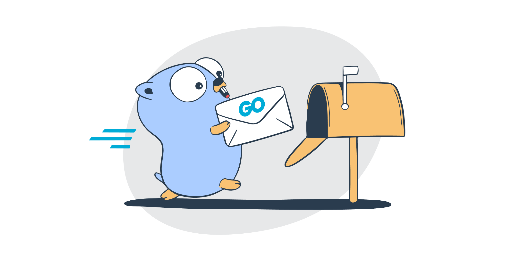

<h1 align="center">Envio de Email com golang</h1>
<p align="center">
  
</p>

<h2 align="center">Tecnologias usadas</h2>

> GO 1.20 

> Gin Framework

> LIBPQ 

> JWT 

> Postgresql


<h2 align="center">Instalação</h2>

```
Ter o Go instalado em sua maquina 
Link: https://go.dev/doc/install

Rodar este comando no terminal (dentro da pasta raiz do projeto):
go mod tidy

Configurar arquivo example.env
```

<h2>Rotas</h2>

> /api/login POST

> /api/mail POST

> /api/mails GET 

> /api/user POST (CADASTRO USER)

>/api/users GET 

>/api/delete-user DEL

>/api/atualizar-user PUT

<h2 align="center">Sobre o projeto</h2>
<p>O projeto segue um fluxo bem simples, podendo cadastrar um usuario, realizar operação de CRUD no usuario, e enviar email. 
    Para realizar todas estas operações, usei um middleware escrito em gin e JWT para autenticar e realizar login do usuario, depois de logado, o usuario podera realizar CRUD, e enviar emails com sua assinatura. 
    Também implementei uma rota onde recebemos todos os emails enviados, mas, você só tera acesso a esta rota se o seu tipo de usuario for do tipo "admin", ou seja, também implementei um tipo e autorização onde usuarios do tipo "user" só pode realizar CRUD nele mesmo, e enviar emails, para rotas de acesso mais profundas, o usuario do tipo "user", não tera acesso.
    Os emails são guardados em um banco de dados e podem ser resgatados na rota "/api/mails
</p>